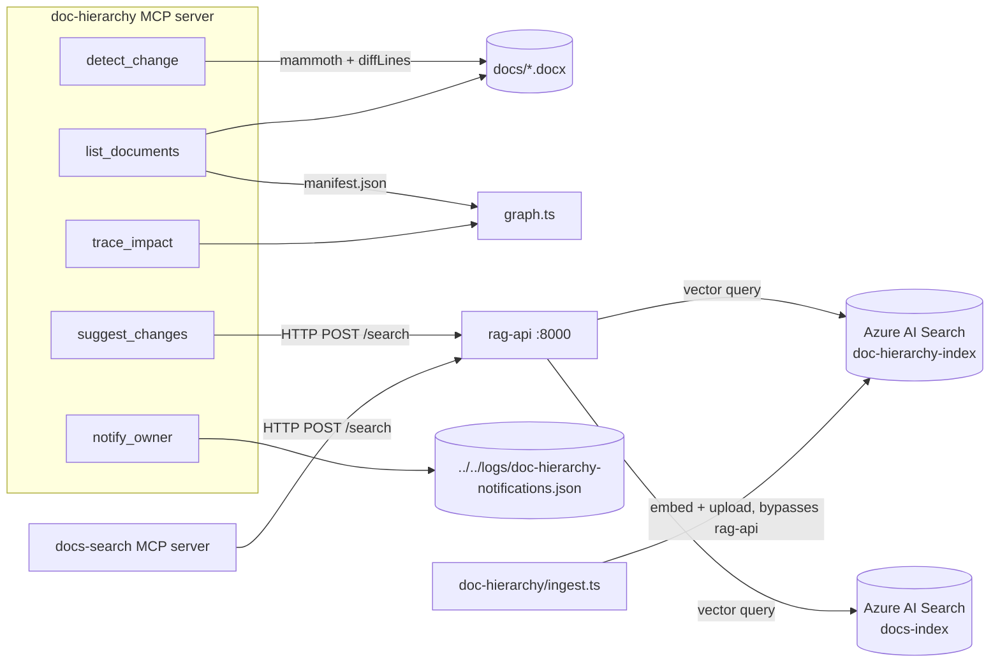

# Briefing — `doc-hierarchy` and supporting pieces, as built today

**Scope:** describes actual runtime behavior of [doc-hierarchy](../doc-hierarchy/src) and the
pieces it depends on ([rag-api](../rag-api/src), plus [docs-search](../docs-search/src) as the
sibling consumer of the same `rag-api`). This is a snapshot of what the code in the tree does,
not a plan — see `000`–`002` for design history and rationale.

**Important gap vs. prior ADRs:** [001.feature-apply-and-signoff.md](001.feature-apply-and-signoff.md)
and [002.feature-apply-and-signoff-fine-tuning.md](002.feature-apply-and-signoff-fine-tuning.md)
describe `metadata.ts`, `applyChange.ts`, `signoff.ts`, and four MCP tools
(`apply_change`, `signoff`, `signoff_status`, `approve_baseline`). **None of these exist in the
tree.** [doc-hierarchy/src](../doc-hierarchy/src) contains only `createIndex.ts`,
`currentBaseline.ts`, `detectChange.ts`, `graph.ts`, `ingest.ts`, `mcpServer.ts`, and
`mcpServer.ts` exposes 5 tools, not 9. Everything below documents that 5-tool, apply/signoff-free
state as it exists now.

---

## 1. System shape

Two independent MCP servers (`doc-hierarchy`, `docs-search`) each run as a local stdio process
and share one `rag-api` Express server for **read-path** vector search only. Both POCs write to
their indexes directly via `@azure/search-documents` in their own `ingest.ts` — `rag-api` is
never in the write path.

---

## 2. `rag-api` — shared vector search server

[rag-api/src/ragApi.ts](../rag-api/src/ragApi.ts)

- Single Express server, one route: `POST /search`.
- Body: `{ index, query, top_k = 5, filter? }`. Returns `400` if `index` or `query` is missing.
- Per-index `SearchClient` instances are cached in a `Map`, created lazily on first request for
  that index name — so it transparently serves both `docs-index` and `doc-hierarchy-index` (or
  any other index) from one process without per-index configuration.
- Embeds the query text itself (via `embed.ts`), then does a pure vector search
  (`search("*", { vectorSearchOptions: {...} })`) with an optional OData `filter` string passed
  straight through from the caller.
- Strips the `embedding` field out of each hit before returning — 384 floats per hit that no
  caller needs.
- Reads `.env` from the **monorepo root** (`new URL("../../.env", import.meta.url)`), not cwd —
  works regardless of where `npm run rag-api` is invoked from.
- Listens on `process.env.PORT ?? 8000`. Runs once, shared by every consumer for the life of
  the session.

[rag-api/src/embed.ts](../rag-api/src/embed.ts)

- Wraps `@huggingface/transformers`' `Xenova/all-MiniLM-L6-v2` feature-extraction pipeline
  (384-dim, local, no Azure OpenAI calls).
- Caches the **resolved pipeline** in a module-level variable (`extractor ??= await pipeline(...)`).
  This is safe here because `rag-api` only calls `embed()` once per incoming HTTP request — there
  is no concurrent-first-call race like the one `ingest.ts` had to guard against (see §3).

---

## 3. `doc-hierarchy` — ingest pipeline (write path, bypasses `rag-api`)

[doc-hierarchy/src/ingest.ts](../doc-hierarchy/src/ingest.ts)

- Entry point: `tsx src/ingest.ts [folder]`. If no arg given, ingests
  `getCurrentBaselineDir()` (i.e. whatever `current-baseline.txt` currently points to);
  otherwise the given folder resolved against `packageRoot`.
- For every `.docx` in that folder:
  1. Extracts HTML (for the metadata table) and raw text (for chunking) via `mammoth`.
  2. Parses the metadata table (`Document ID`, `Owner`, `Reviewer`, `Depends On`) with
     `parseMetadata`. Throws naming the missing column(s) if any required field is absent,
     rather than a raw `TypeError`.
  3. **Deletes stale chunks first**: queries `doc-hierarchy-index` for existing docs with that
     `docId` (OData filter, single-quotes escaped), deletes them, then uploads fresh chunks.
     Combined with deterministic chunk IDs (`${docId}-${i}`), re-ingesting the same doc (new
     baseline, re-run) never accumulates duplicates or leaves orphaned chunks when content shrinks.
  4. Chunks raw text at a fixed 1000 characters (`chunk()`), with no sentence/paragraph
     awareness — can split mid-sentence and, for short docs, folds the metadata table's text
     into the first chunk.
  5. Embeds each chunk locally (own copy of `embed()`, not imported from `rag-api`) and uploads
     all chunks in one `uploadDocuments` call.
- `embed()` here caches the **promise**, not the resolved pipeline (`extractorPromise ??= pipeline(...)`),
  because `Promise.all(chunks.map(...))` fires every chunk's embed call before any has resolved —
  caching only the resolved value would start one model load per chunk.
- `source` field stored is a **repo-relative, forward-slash path** (`docs/baseline1/X.docx`),
  never an absolute filesystem path.
- `SearchClient<HierarchyDoc>` is explicitly typed — an untyped client makes
  `deleteDocuments("id", ids)` fail to compile (`keyof TModel` resolves to `never`).

[doc-hierarchy/src/createIndex.ts](../doc-hierarchy/src/createIndex.ts)

- Idempotent `createOrUpdateIndex` against `doc-hierarchy-index`: `id` (key), `docId`, `content`,
  `source`, `owner`, `reviewer`, `dependsOn` (all filterable except `content`), and a 384-dim
  `embedding` vector field with an HNSW profile.

[doc-hierarchy/src/currentBaseline.ts](../doc-hierarchy/src/currentBaseline.ts)

- Exports `packageRoot` — the single anchor (`fileURLToPath(new URL("..", import.meta.url))`)
  every other module in the package resolves paths against, instead of `process.cwd()`. This
  matters specifically because the MCP server's cwd is whatever process launched it (e.g. an
  MCP client), not the package directory.
- `getCurrentBaselineDir()` reads `current-baseline.txt` (one line, e.g. `baseline1`) and joins
  it under `docs/`. There is no fallback — a missing/unreadable file throws.

[doc-hierarchy/src/graph.ts](../doc-hierarchy/src/graph.ts)

- `loadGraph()` reads `manifest.json` from *inside* the current baseline directory (frozen
  alongside that baseline's docs, not a top-level file) — an array of `{ docId, dependsOn }`.
- `downstreamOf(graph, docId)` is a plain BFS over `dependsOn` edges: seed with the changed doc,
  repeatedly add any doc whose `dependsOn` includes something already in the affected set. No
  cycle guard is needed only because `affected.has()` prevents re-queuing, so a cycle can't
  cause an infinite loop, but a cycle also isn't detected/reported as an error.

[doc-hierarchy/src/detectChange.ts](../doc-hierarchy/src/detectChange.ts)

- `detectChange(baselinePath, draftPath)`: extracts raw text from both `.docx` files via
  `mammoth`, returns `null` if identical, otherwise `diffLines` output filtered to only
  added/removed lines, formatted as `+ `/`- ` prefixed, trimmed lines.
- Paragraph-level diff granularity (not word-level) — a single-word edit shows its whole
  containing paragraph as one removed line and one added line.

---

## 4. `doc-hierarchy` — MCP server tool surface (5 tools, as built)

[doc-hierarchy/src/mcpServer.ts](../doc-hierarchy/src/mcpServer.ts)

All mutating/path-taking inputs from the model are resolved through `resolveDocPath`, which
resolves against `packageRoot` and **rejects anything that resolves outside `docs/`**. There is
no `resolveWritablePath`/baseline-write-protection in this file — every path under `docs/`,
baselines included, is treated the same, because no tool in this build actually writes into a
document file. (That protection is only meaningful once `apply_change` exists — see §1's gap note.)

| Tool | Input | Behavior |
|---|---|---|
| `list_documents` | `draftDir` (default `"docs/draft2"`) | Loads the graph (from the baseline's `manifest.json`) to get the doc-ID list, then for each ID compares `<baselineDir>/<docId>.docx` vs `<draftDir>/<docId>.docx` byte-for-byte. Reports `missing` if either side doesn't exist, else `same`/`CHANGED`. This is the only discovery tool — it exists because nothing else exposes the folder layout to the model. |
| `detect_change` | `docId`, `baselinePath`, `draftPath` | **Ignores `docId`** in this build — despite the description, the schema still requires explicit `baselinePath`/`draftPath` (both passed through `resolveDocPath`). Delegates to `detectChange()`. Returns `"No changes detected."` literal text if `null`. |
| `trace_impact` | `docId` | Loads the graph, calls `downstreamOf`, returns a comma-joined list or `"No downstream documents found."` |
| `suggest_changes` | `docId`, `changeSummary` | POSTs to `rag-api` (`RAG_API_URL`, default `http://localhost:8000/search`) against `doc-hierarchy-index`, `top_k: 5`, filtered to `docId eq '<escaped docId>'`. Returns the matched chunk contents, or a "no related passages" message. |
| `notify_owner` | `docId`, `message` | Appends `{ timestamp, docId, message }` to a JSON array file, **stub only** — no email/Teams integration. |

Note the ADR 002 (`docId`-based) redesign of `detect_change` and the `list_documents`
discovery tool it introduced were partially adopted: `list_documents` exists, but
`detect_change`'s signature still matches the original plan (explicit paths), not ADR 002's
`docId`-driven resolution.

### `notify_owner` / notification log details

- `NOTIFY_DIR` defaults to `<packageRoot>/../../logs` — i.e. the **monorepo root's `logs/`
  folder**, deliberately outside `doc-hierarchy/` (and outside anything `.gitignore`'d under
  `docs/**`), so notifications survive baseline promotions/branch switches.
- `appendNotification` is a synchronous read-modify-write (`readFileSync` → mutate array →
  `writeFileSync`) with no `await` in between, which is claimed (in a code comment) to make it
  safe against concurrent MCP tool calls interleaving — true only because Node's single-threaded
  event loop won't preempt a fully synchronous function body, not because of any explicit lock.
- If the log file exists but doesn't parse as a JSON array, `appendNotification` throws rather
  than silently overwriting it.
- Writes to `console.error`, not `console.log` — stdout is the JSON-RPC transport for a stdio
  MCP server, so anything written there would corrupt the protocol stream.
- Observed real data in [logs/doc-hierarchy-notifications.json](../../logs/doc-hierarchy-notifications.json):
  two entries for the `SYS-REQ-001` 800m→750m braking-distance scenario described in
  `000.hackathon-plan.md`, confirming the detect→trace→suggest→notify chain has actually been
  exercised end-to-end against the sample data.

---

## 5. `docs-search` — sibling POC sharing `rag-api`

[docs-search/src/mcpServer.ts](../docs-search/src/mcpServer.ts) is structurally identical to
`doc-hierarchy`'s `suggest_changes`/`rag-api` call: one tool, `search_docs`, POSTs
`{ index: "docs-index", query, top_k: 5 }` (no filter) to the same `RAG_API_URL` and formats
each hit as `Source: <source>\n<content>`. It has no graph/hierarchy/change-detection concept —
it's a flat semantic search over `docs-index`, confirming `rag-api`'s "no schema, no business
fields, just embed+search+filter" design goal from `000.hackathon-plan.md` actually holds for
both consumers.

---

## 6. Cross-cutting invariants observed in the code

- **No `process.cwd()` dependency anywhere in `doc-hierarchy`.** Every path (`.env`,
  `current-baseline.txt`, `docs/`, the notification log, `process.argv[2]`) is resolved against
  either `packageRoot` or a `new URL(..., import.meta.url)` anchor.
- **Model-supplied paths are always confined.** `mcpServer.ts`'s `resolveDocPath` is the only
  gate between a model's tool-call arguments and the filesystem, and every path-shaped tool
  input passes through it.
- **`docs/**` is gitignored** (only `.gitkeep` tracked per prior ADRs) — sample baselines,
  drafts, and `manifest.json` files are not recoverable via git. Not independently re-verified
  in this pass; carried over from `000-fixes` and `002` as a standing operational fact.
- **Two Azure AI Search indexes, one shared service, one shared `rag-api` process**:
  `docs-index` (docs-search) and `doc-hierarchy-index` (doc-hierarchy). Both are written to
  directly by each POC's own `ingest.ts`/`createIndex.ts` — `rag-api` only ever serves reads.
- **Every OData filter value passed to Azure Search is quote-escaped**
  (`.replace(/'/g, "''")`) at both call sites that build one (`ingest.ts`'s stale-chunk
  lookup, `mcpServer.ts`'s `suggest_changes`).

## 7. Known gaps / incomplete behavior in this snapshot

- No `apply_change`, `signoff`, `signoff_status`, or `approve_baseline` tool exists — a user
  cannot promote `draft2` to a new baseline, record signoffs, or edit a `.docx` through MCP at
  all in this build. `current-baseline.txt` and baseline folder renames would have to be done
  by hand.
- `detect_change` does not use `docId` to auto-resolve baseline/draft paths as ADR 002
  describes — callers (or the calling model) must still supply `baselinePath`/`draftPath`
  explicitly, which `list_documents`'s output is presumably meant to supply.
- `notify_owner` is explicitly a stub (comment: "wire up email/Teams later") — no actual
  notification delivery exists.
- `chunk()` in `ingest.ts` still splits at a fixed 1000 characters with no paragraph awareness,
  as accepted-as-is in `000-fixes`.
